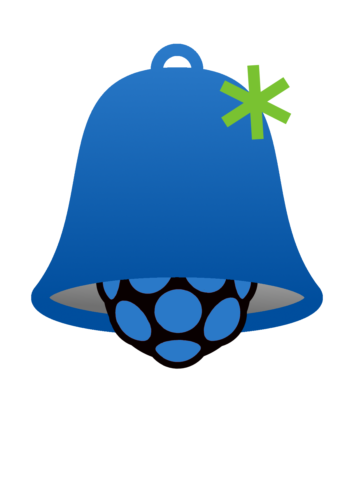

# BeLL Ground Server Manual

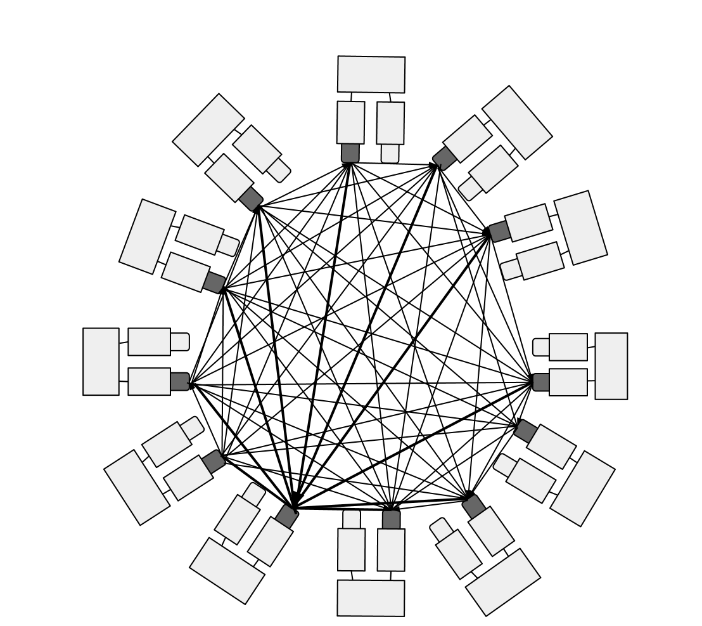

## How to Build, Deploy, and Sync Ground Servers into the Sneakernet using Raspberry Pis

[Open Learning Exchange International](http://ole.org)

# 1. Building Ground Servers

In this manual we will demonstrate how the BeLL Ground Server design can be used to set up a Sneakernet using the principles of Ground Computing.  Future tutorials will include how to manage the Ground Server Lite and Ground Server Mobile designs.  We’ll start by getting the hardware together and prepare SD cards using an Internet connection. Later parts of this tutorial will not require an Internet connection, only the first download of the required software will require an Internet connection.

## Putting the hardware together

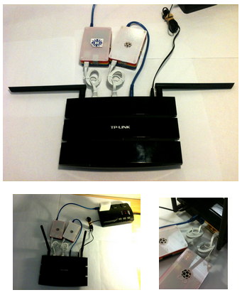

[The BeLL Ground Server][6] is a 17 Watt Ground Server that supports up to 30 WiFi devices, includes data redundancy, and supports replication with travelling SD Cards and/or the BeLL Ground Server Mobile design.  These things are the backbone of the Sneakernet.

   [6]: https://docs.google.com/a/rjsteinert.com/document/d/1u1fHq4DdHjAm2MUHtpJF3w9Vcv08Vrww-53V9cBbiuM/edit

- 2 Raspberry Pis ($35x2, a second Pi for data redundancy and the ability to send an SD Card to the next node for replication)

- 2 Raspberry Pi cases ([$7.35x2][7])

   [7]: http://www.mcmelectronics.com/product/83-14271

- 1 WiFi Router (Suggested TP-Link TL-WDR3500 at $50)

- 1 Micro USB Charger ($6)

- 1 short Micro USB-male to USB-male chord ([$1.49][8])

   [8]: http://www.mcmelectronics.com/product/83-14274

- 2 short RJ-45 Ethernet cables ([$.49x2][9])

   [9]: http://www.mcmelectronics.com/product/831-2487

- 3 SD Cards ([$9x3][10], the third card is for when the second card is traveling to another node for replication)

   [10]: http://www.microcenter.com/product/349729/16GB_Class_10_Secure_Digital_High_Capacity_(SDHC)_Flash_Media_Card

Total: $170

## Setting up SD cards

Now that you have your hardware together, you’ll want software to run on your Pi’s. In the next few steps we walk through installing various things you’ll want on your Pi’s SD Cards, but if you want to skip this, download the finished product (link coming) and move on to “Cloning SD Cards”.

Download Occidentalis and follow the instructions [here][11]. 

   [11]: http://learn.adafruit.com/adafruit-raspberry-pi-educational-linux-distro/occidentalis-v0-dot-2

Now that you have your Occidentalis image on your SD card, boot up your Raspberry Pi for the first time with the Occidentalis image installed.  If you don’t have a keyboard and monitor for the Pi, you can ssh into the from a Mac or Linux PC by running “ssh pi@raspberrypi.local” with a password of “raspberry”. First, run “raspi-config” and select expand_rootfs to expand the memory card to the limits of your SD Card otherwise you will have very little free memory.  Then navigate to “Finish” (down down down right) and your Pi will restart to do the resize operation (this takes a few minutes).  When you log in again you’ll want to run the following command to get the wonderful scripts written by Adafruit described in Deploying Ground Servers.

#### curl https://raw.github.com/adafruit/Adafruit-WebIDE/alpha/scripts/install.sh | sudo sh

Also run the date command to make sure your Pi has the correct date settings (important later for resolving merge conflicts in data replication).

## Installing CouchDB

CouchDB is a         a fully decentralized and Open Source data platform that also has the ability to serve Ground Apps! CouchDB’s replication feature is the glue that holds the network together making possible [Eventual Consistency][12] in the network, a core concept in [Ground Computing][13].  

   [12]: http://guide.couchdb.org/draft/consistency.html
   [13]: http://bell-dev.blogspot.com/2012/12/about-ground-computing-drafts-for.html

[Check out the groovy tutorial on installing CouchDB from the BeLL Development Blog.][14]

   [14]: http://bell-dev.blogspot.com/2012/12/installing-couchdb-on-raspberry-pi.html

## Getting started with Ground Apps

Now that you have CouchDB installed on your Raspberry Pi, it’s time to get some Ground Apps for your users to use!  If you are interested in the code of the following apps mentioned, check it out on [the Open Learning Exchange organization page on GitHub][15]. Don’t forget to fork us! :)

   [15]: https://github.com/open-learning-exchange

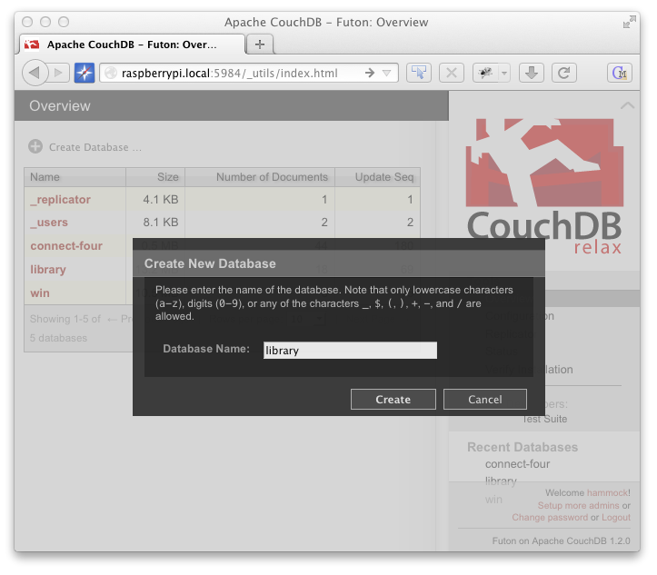

You can access your Pi from an mDNS compatible device at [http://raspberrypi.local][17], CouchDB is on port 5984 by default, and we want to go to the default Futon CouchApp at [http://raspberrypi.local:5984/_utils][18]. Create your first user (I’ve created user “hammock”) and create a database to place some Couch Apps into.

   [17]: http://raspberrypi.local
   [18]: http://raspberrypi.local:5984/_utils

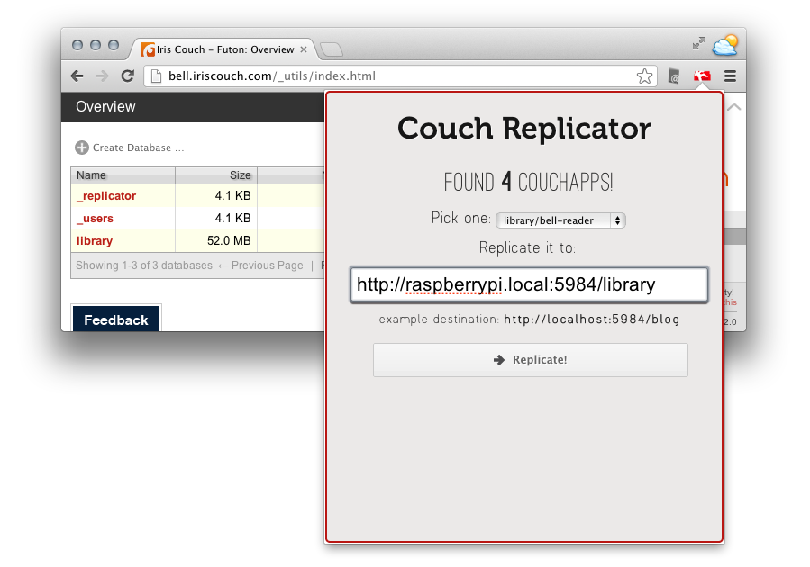

Lets get some CouchApps from [http://bell.iriscouch.com][20]. There are [a couple of different ways to get CouchApps for CouchDB][21] installed. [Max Ogden’s extension for Google Chrome ][22]makes it pretty easy.

   [20]: http://bell.iriscouch.com
   [21]: http://couchapp.org/
   [22]: https://chrome.google.com/webstore/detail/couchdb-replicator/clbdmcdmjlpgedncppkbkepbilnhgddh

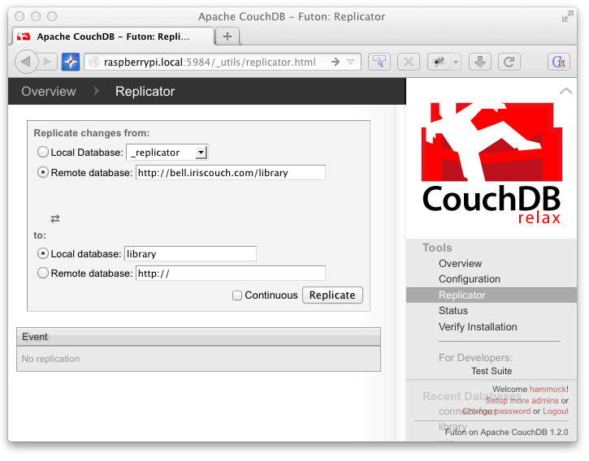

But since you might not have that Chrome extension handy, you can also replicate the library database on bell.iriscouch.com to get all of the CouchApps there.

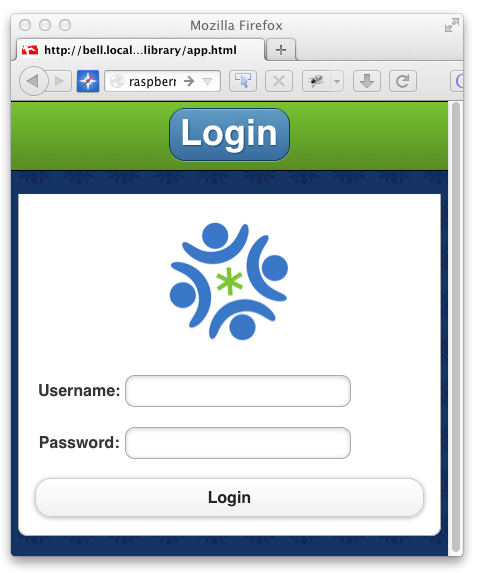

At [http://raspberrypi.local:5984/library/_design/library/app.html][25] you’ll find the BeLL School Library App. 

   [25]: http://raspberrypi.local:5984/library/_design/library/app.html

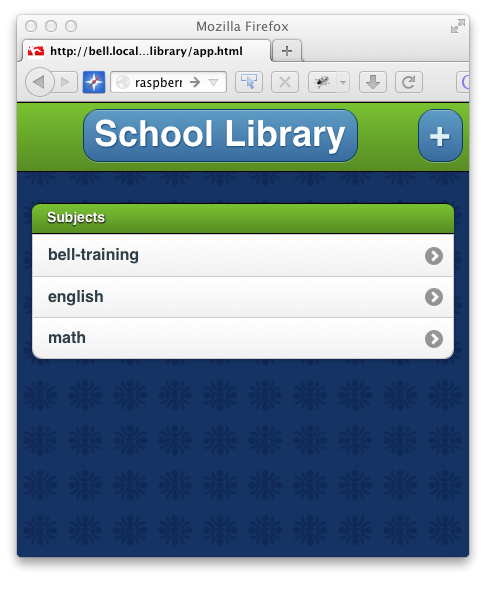

   [26]: pubimage?id=1zINzqT5tLy8nyaDLvdp5wDYC-GoeqDH0Uny5PsVmNvg&image_id=1jGpej1c80-tPLgM2u0KvqTc9W-lmBZVG

Now you can browse some Open Educational Resources by subject and level.  

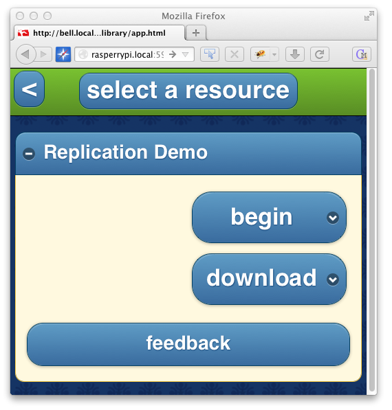

Clicking “begin” on a resource will open it up into in the appropriate HTML5 App.  Clicking “download” will download the resource to your local machine.  Clicking “feedback” will show you feedback on the resource and allow you add your own feedback.

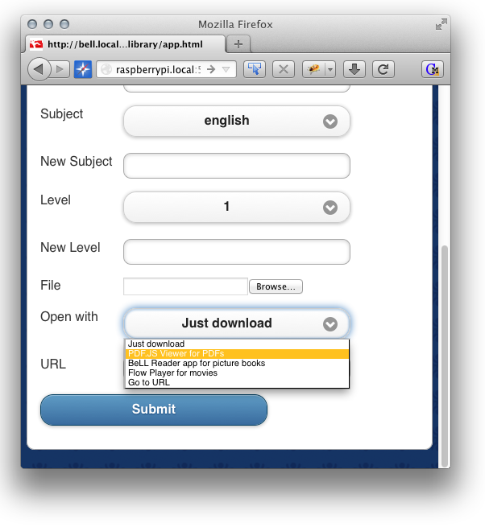
se
When you add resources, make sure to select the correct HTML5 App for the kind of document you are uploading so the “begin” button will work correctly.

## Cloning SD Cards

Now that you have your first SD card all ready for Ground Computing, you’ll want to clone it to the other 2 SD Cards for the BeLL Ground Server you are creating.  The first thing you’re going to do is create an “image” (.img) file of what you just cooked up.  Before you plug the SD Card into an SD Card Reader and plug that into a Mac or Linux PC, run the “df” command from a terminal on your PC.  Observe the drives listed. You’ll now plug your SD Card reader into your PC and run “df” again to see what new drive is available.  Now unmount that new drive by using the “umount” command.  On Macs you may need to use the “diskutil umount” command.

> sudo umount /dev/disk1s2

Now for converting the disk to an image. Note that this command will take a while and the resulting img file will be as large as the SD Card’s total memory.

> dd if=/dev/disk1 of=./newDiskImage.img 

Now replace that SD Card with a blank SD Card.  Run the df command to find it, and then unmount it with umount.  At last we’re ready to put that img onto a new SD Card. Run:

> dd if=./newDiskImage.img of=/dev/disk1

When that finishes, plug in your third SD Card, umount it, and then dd the image onto it.

# 2. Deploying Ground Servers

## Configuring Ground Servers on LAN

By default, Occidentalis will boot with [Avahi Daemon][29] running with hostname [raspberrypi.local][30].  Avahi Daemon is a service that broadcasts a hostname with the Pi’s IP address so that other devices on the network can address the device reliably by hostname as opposed to clients having address a network service device by IP address which is prone to change and difficult to manage ([Read more about Zero Configuration Networking http://en.wikipedia.org/wiki/Zero_configuration_networking][31]).  Host names are also a lot easier to remember than an IP address so we’re going to give your new Ground Servers memorable hostnames.  Note, changing the hostname from the default hostname of raspberrypi.local leaves the raspberrypi.local hostname open for new devices to be configured on the network. Win!

   [29]: http://linux.die.net/man/8/avahi-daemon
   [30]: http://raspberrypi.local/
   [31]: http://en.wikipedia.org/wiki/Zero_configuration_networking

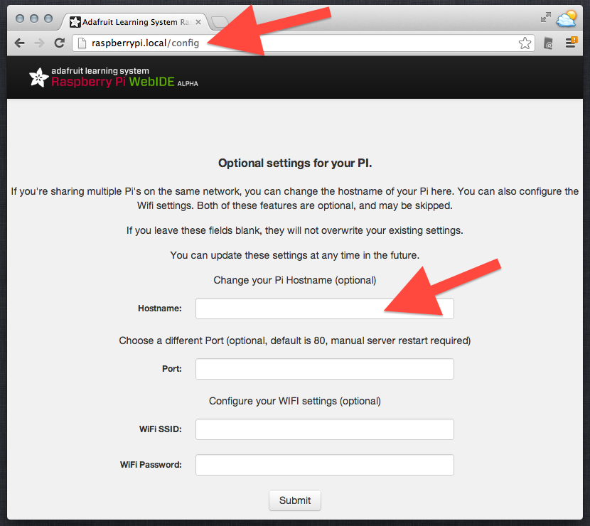

From an mDNS compatible device you’ll want to go to raspberrypi.local/config

 Enter a new hostname for this Pi so other Pi’s can be introduced onto this network and configured from [http://raspberrypi.local/config][33], otherwise you’ll have multiple Pi’s fighting over the raspberrypi hostname. 

   [33]: http://raspberrypi.local/config

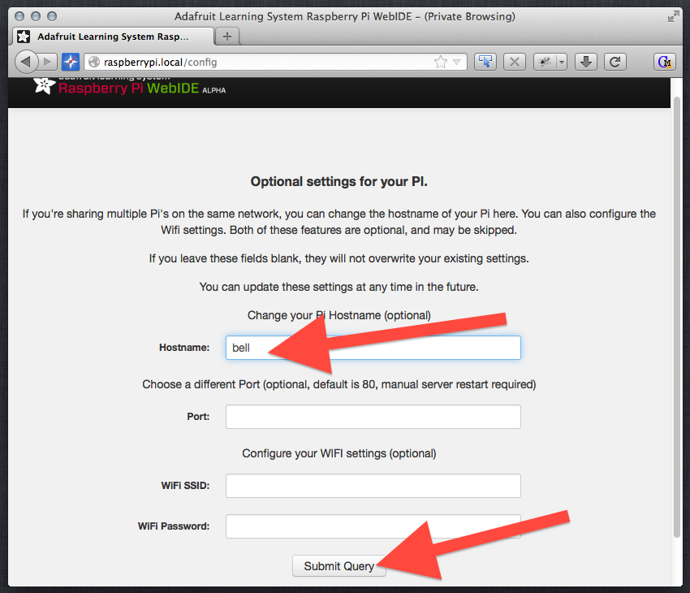

Enter a hostname of “bell” and then click Submit Query. If you get an error of “Server Not Found”, don’t worry, the mDNS takes a minute sometimes to propagate so in a few minutes try [http://bell.local][35]/ again. If after a few minutes it still doesn’t work, try again at http://raspberrypi.local/config

   [35]: http://bell.local

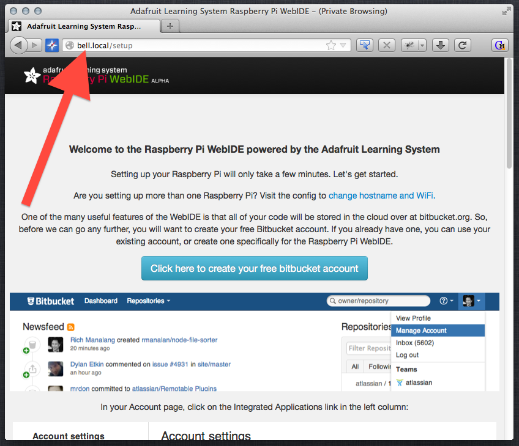

Ta da! Your first Pi is now at [http://bell.local/][37]

   [37]: http://bell.local/

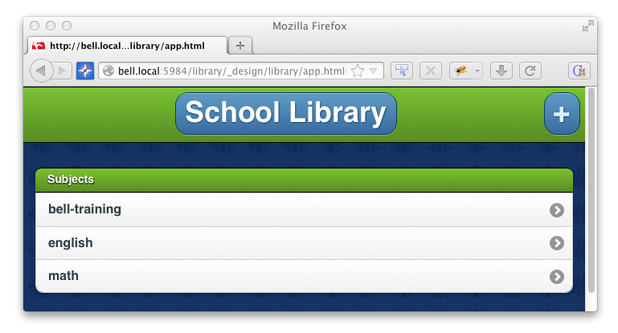

And here is CouchDB on port 5984 and the BeLL Library App at [http://bell.local:5984/library/_design/library/app.html][39]

   [39]: http://bell.local:5984/library/_design/library/app.html

3. Setting up the Sync Server

Now you’ll want to set up your Sync Server using your second Pi so your can sync with other nodes in the Sneakernet.  Plug one of your SD Cards that still has hostname of “raspberrypi” into your second Pi and plug it into the network.  Repeat the process above for changing the hostname except this time you’ll want to rename the hostname to “sync”.

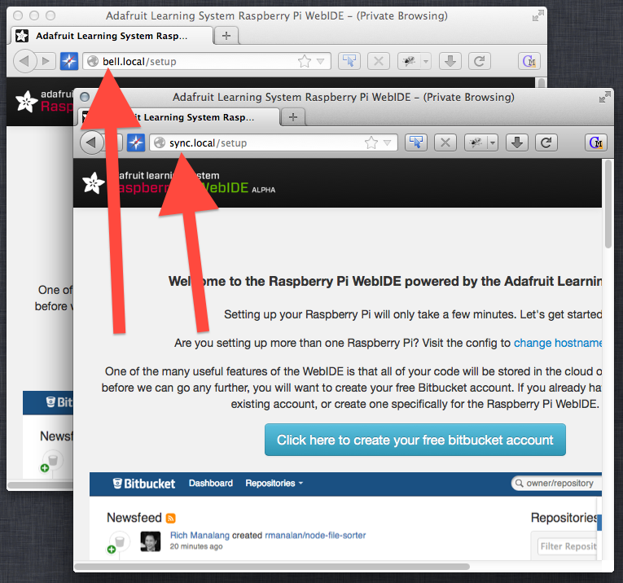

The end result will be a Pi accessible at [http://bell.local/][41] and a Pi accessible at [http://sync.local/][42]

   [41]: http://bell.local/
   [42]: http://sync.local/

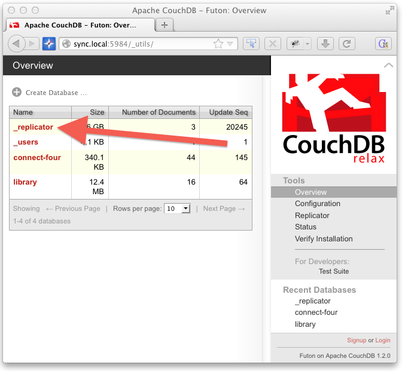

   [43]: pubimage?id=1zINzqT5tLy8nyaDLvdp5wDYC-GoeqDH0Uny5PsVmNvg&image_id=1wR4Ral5b0Q0vnT0Y7vc--ui2OZOzcSHs

Go to the Futon CouchApp on each Grond Server at [http://bell.local:5984/_utils][44] and [http://sync.local:5984/_utils][45] 

   [44]: http://bell.local:5984/_utils
   [45]: http://sync.local:5984/_utils

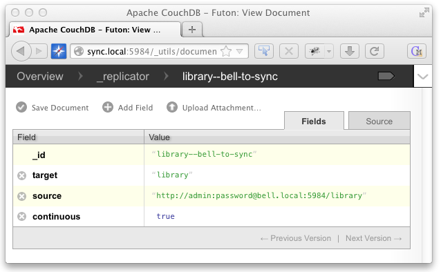

Click on “New Document” and then “Add Field” until the fields look like the screenshot. Note that this object editing interface can be a little confusing to use.  Double click to edit things and then press the enter key to confirm them.  For _id, We have chosen a replicator entry naming convention of {database}--{source}-{target}.  The source field is where we’ll be looking for new data while the target field is where we will be placing new data.  The continuous field is what will tell CouchDB to continue, even after we first submit this, to look for changes in the source database to replicate to the target database.  Because the target is local and the source is remote, this is referred to as pull replication. Now we’re going to set up push replication from sync.local to bell.local.  

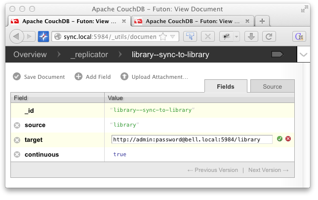

Create another document in the _replicator database and set it up as shown above.  Note the source and target have been reversed from the pull replication example.  This is because we want changes on the sync.local server to be pushed to the database on the bell.local server, this is push replication.

Push replication + Pull replication = Sync!

Let’s do a quick test to see if creating a document in one database will cause it show in the other database.

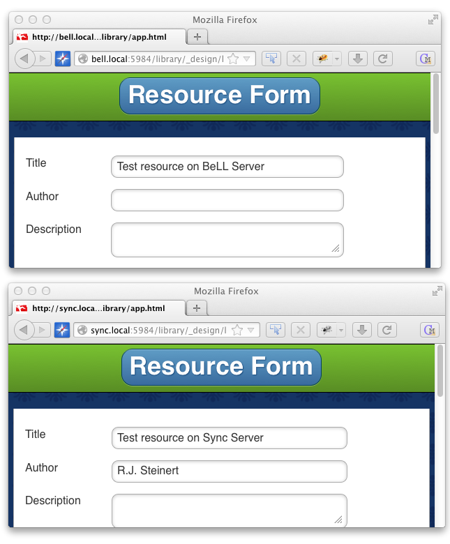

At [http://bell.local:5984/library/_design/library/app.html#page-resource-form][49] and [http://sync.local:5984/library/_design/library/app.html#page-resource-form][50] I add two files, one on each server.

   [49]: http://bell.local:5984/library/_design/library/app.html#page-resource-form
   [50]: http://sync.local:5984/library/_design/library/app.html#page-resource-form

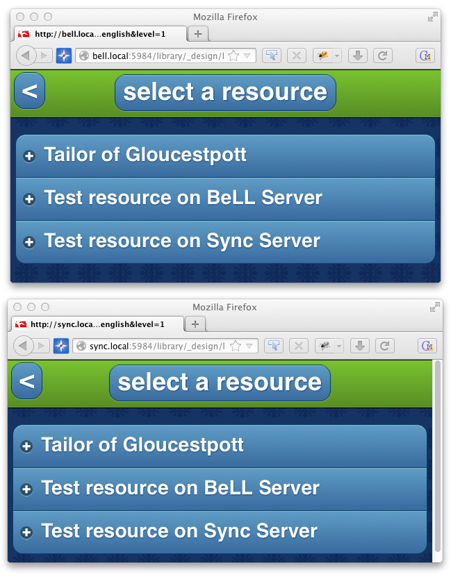

There they both are on both servers! The sync is working.

# 4. Sync your BeLL Ground Server with other nodes in the Sneakernet

If you have an Internet connection, check out my demonstration video: [http://www.youtube.com/watch?v=aQWXaOVAJcQ][52]

   [52]: http://www.youtube.com/watch?v=aQWXaOVAJcQ

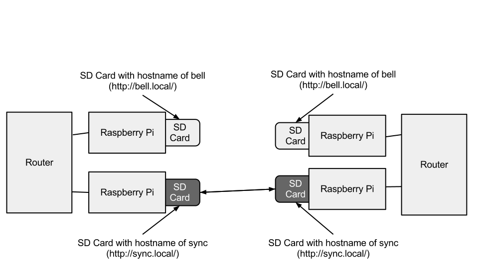

To sync one BeLL Ground Server to another BeLL Ground Server, all you need to do is move the SD Card with hostname sync from one Node’s Pi to the place where the other Node’s sync SD Card usually sits.  

The BeLL Ground Server is designed to facilitate many to many data replication.  

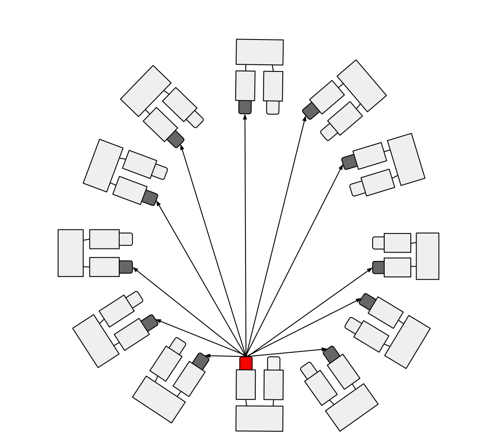

In one to many data replication, all data moves through a parent node before it can move to the children nodes.

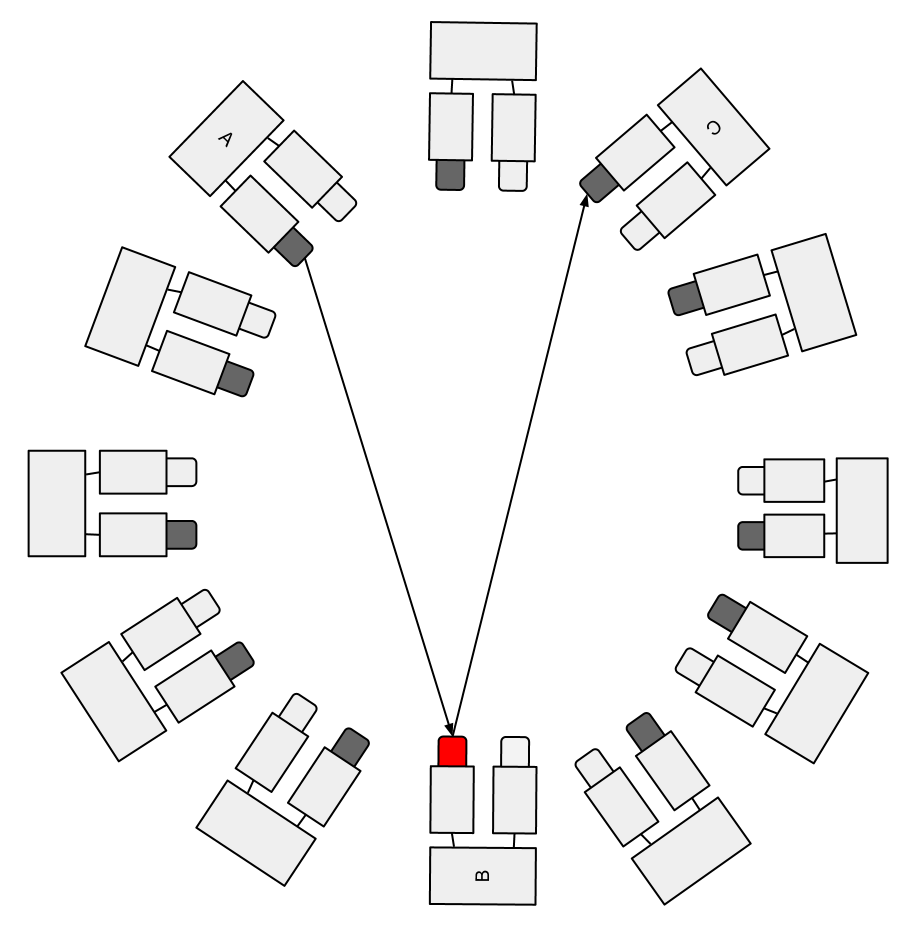

For data to move from node A to node C in a one to many data network, data has to replicate to node B before it can move to node C.

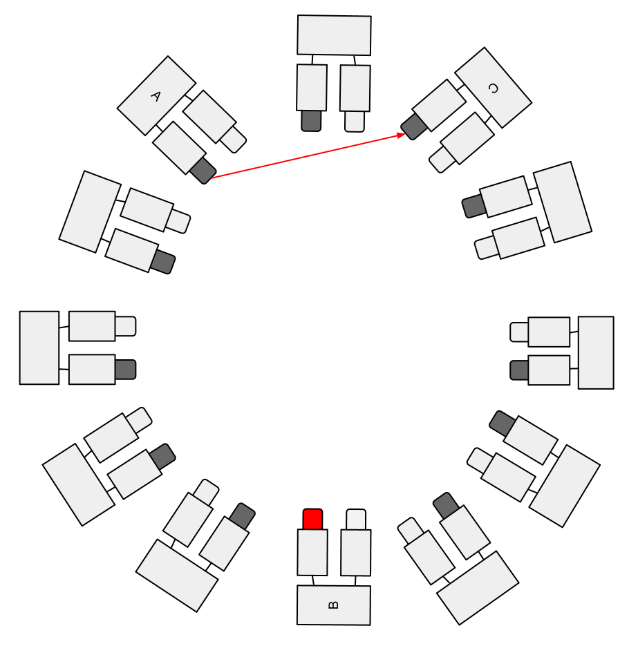

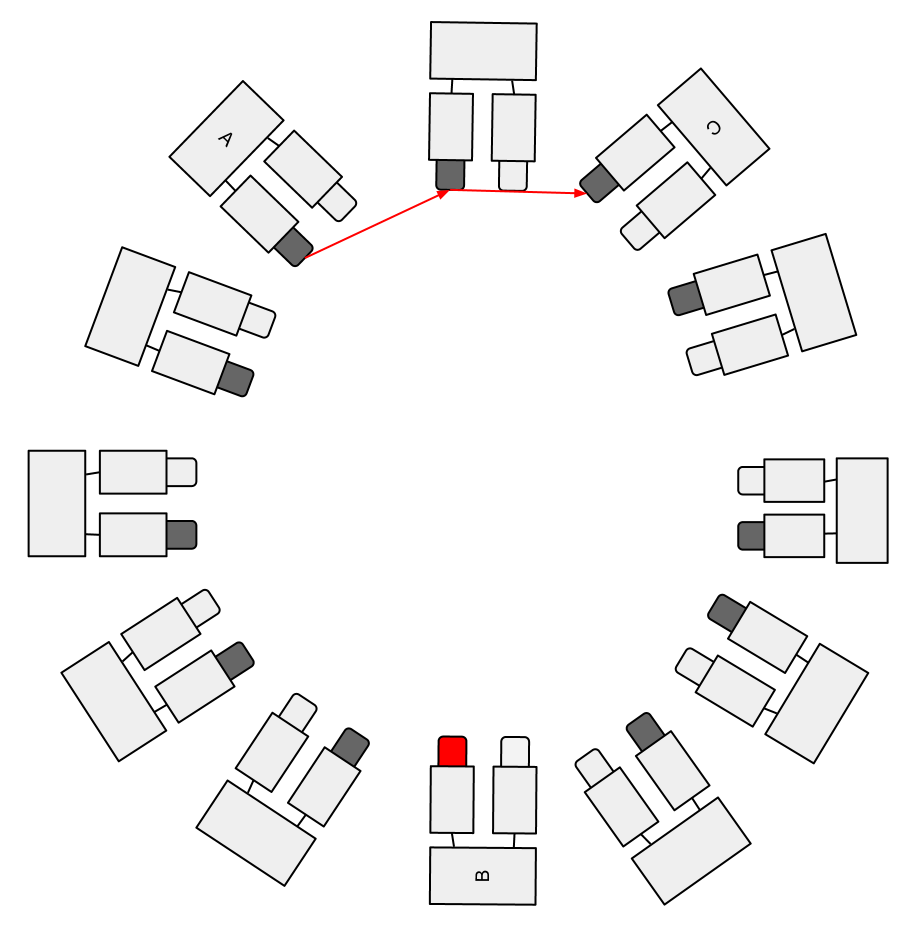

For data to move from node A to node C in a many to many data network, data can travel directly between node A and C or even hop between neighboring nodes.

In a many to many data network, data can move in any direction and hop from node to node is the most efficient path or even the most inefficient.  
